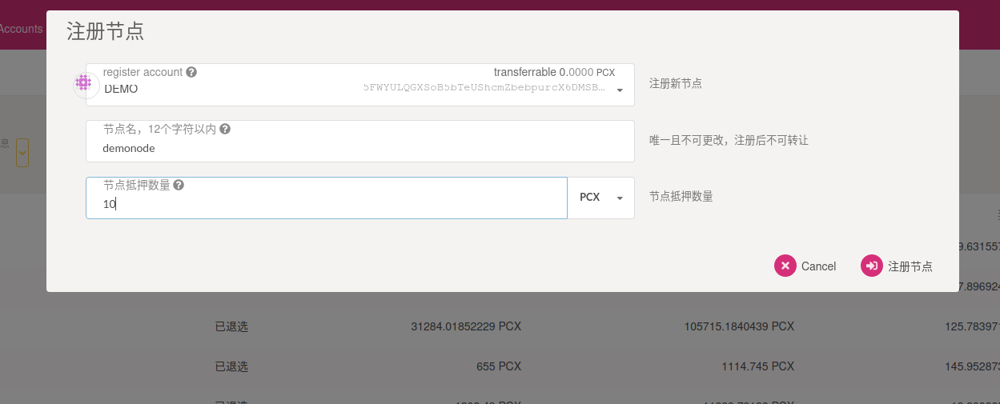
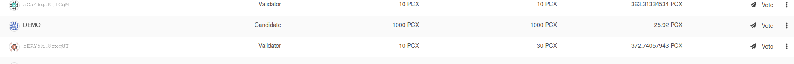
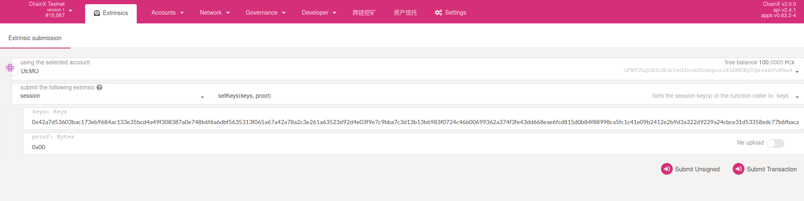
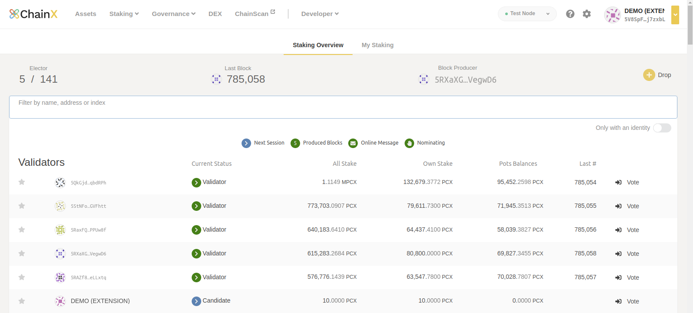
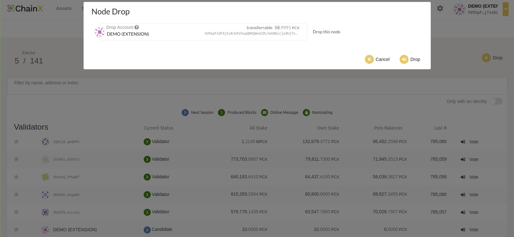
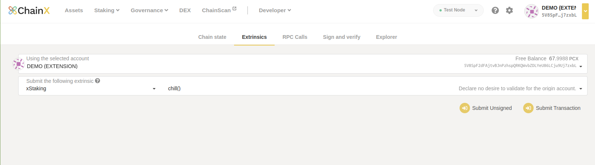
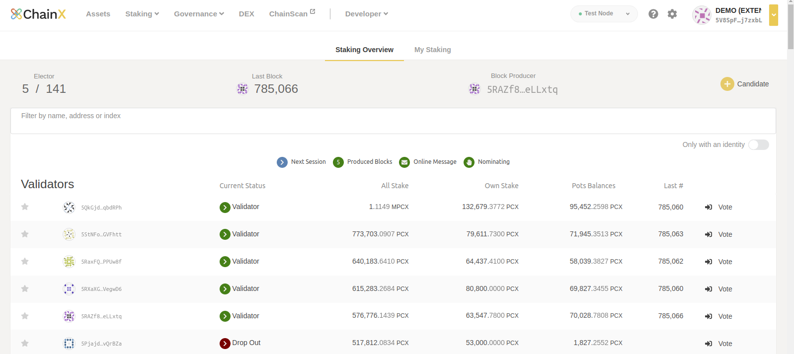
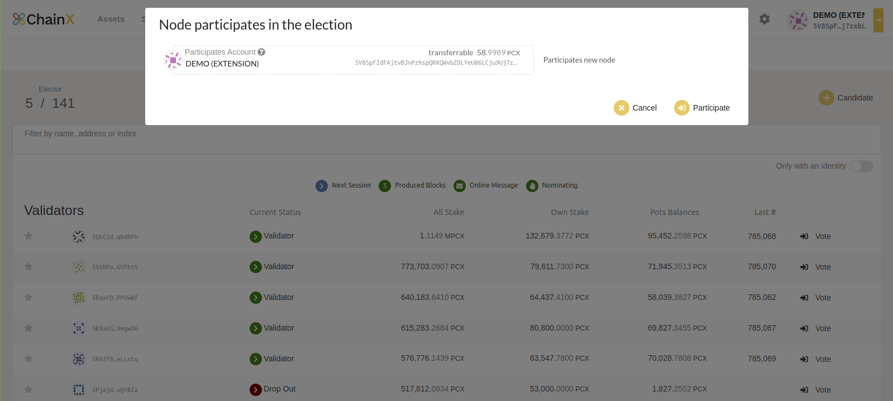
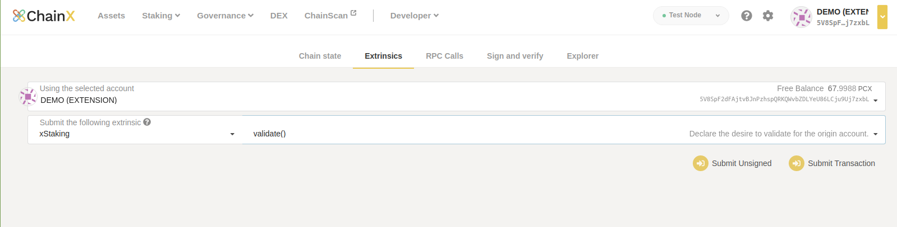

This page is about running a validator node in ChainX network.

## 1. Prepare
### 1.1 Hardware requirements

The most common way for a beginner to run a validator is on a cloud server running Linux. 
You may choose whatever VPS provider that you prefer. 
Ubuntu 20.04+ is recommended.

- OS: Ubuntu 20.04+
- CPU: 4+ Core
- Memory: 4+ GB
- Storage: SSD 300+ GB
- Bandwidth: 10+ M

### 1.2 Install the `chainx` binary

#### 1.2.1 Build from source
install libraries on Ubuntu 20.04

```bash
sudo apt update -y
sudo apt install --no-install-recommends -y \
     git curl ca-certificates \
     gcc g++ cmake clang
```

install Rust on Ubuntu 20.04
```bash
$ rustup install nightly-2021-11-07
$ rustup override set nightly-2021-11-07
$ rustup target add wasm32-unknown-unknown --toolchain nightly-2021-11-07
```

Fetch the source code from GitHub and compile it locally:

```bash
$ git clone https://github.com/chainx-org/ChainX
$ cd ChainX
# Switch to the latest tag
$ git checkout $(git describe --tags $(git rev-list --tags --max-count=1))
# Compile the binary in release
$ cargo build --release
```

The binary is under `/target/release`.

#### 1.2.2 Download the prebuilt binary

You can also directly download from the prebuilt binary from [GitHub release(https://github.com/chainx-org/ChainX/releases)](https://github.com/chainx-org/ChainX/releases).

### 1.3 Synchronize Chain Data

Run the command below to synchronize chain data.

>
>#### `How to sync blocks from genesis(block #0)`
>- (0)  You should know [Debug: panicked at 'Storage root must match that calculated ' #609](https://github.com/chainx-org/ChainX/issues/609)
   >  **if  you use ChainX v4.x.x directly sync blocks will be stuck at #881910** or other block.
>- (1)  Compile [ChainX v3.0.0](https://github.com/chainx-org/ChainX/tree/v3.0.0) by `nightly-2020-09-30` or Download  [chainx-v3.0.0-ubuntu20.04-x86_64-unknown-linux-gnu-1](https://github.com/chainx-org/ChainX/releases/download/v3.0.0/chainx-v3.0.0-ubuntu20.04-x86_64-unknown-linux-gnu-1)
   >  the ChainX v3.0.0 seed nodes are bad, so you should use new mainnet bootnodes with `--bootnodes`
>```
>"/ip4/52.77.243.26/tcp/23555/ws/p2p/12D3KooWQ6GGfmvmmmsbKRmZqMA3A8rxaHz25HvA7JNBbcZhLXtk"
>"/ip4/120.26.57.227/tcp/36789/ws/p2p/12D3KooWEAX2BcQCZP79MuxQpqLQUop7P3tZY97eNxxUgc4ZTu3k"
>"/ip4/47.114.74.52/tcp/36789/ws/p2p/12D3KooWJPMUkGytfAMt3AMqm4AFn4VToXjbWZoC4Z2NxXNXvTwb"
>```
>- (2)  Until **#3038400**, please use ChainX v3.0.0 to synchronize with `NativeElseWasm (default mode)`
>- (3)  For blocks after **#3038400**, complete (2) first, and then replace ChainX v3.0.0 with ChainX v4.x.x to complete the db migration (note that the migration process is irreversible, it is recommended to back up the data first)
>- (4)  ChainX v4.x.x continues to synchronize blocks
>

```bash
$ ./chainx-v3.0.0 --chain=mainnet --pruning=archive \
  --bootnodes="/ip4/52.77.243.26/tcp/23555/ws/p2p/12D3KooWQ6GGfmvmmmsbKRmZqMA3A8rxaHz25HvA7JNBbcZhLXtk" \
  --bootnodes="/ip4/120.26.57.227/tcp/36789/ws/p2p/12D3KooWEAX2BcQCZP79MuxQpqLQUop7P3tZY97eNxxUgc4ZTu3k"

# until block #3038400
$ ./chainx-v4.2.0 --chain=mainnet --pruning=archive 
```

When completed, you need to restart the node with the validator flag.

```bash
$ ./chainx --chain=mainnet --validator
```

Or you can run the above command directly because the validator node will 
run with `archive` by default.

**IMPORTANT! You should wait for the completion of node syncing and 
ensure the session key is set correctly before you become a candidate.**

If the error occurred when node syncing, 
you need to check if the system time is consistent with the internet time and 
remove the full database before you try again

#### 1.3.1 Configuration

The recommended config for validator node:

```json
{
  "log-dir": "./log", // log directory
  "enable-console-log": false, // disable print log to stdout
  "no-mdns": true,
  "validator": true, // For validator node, it must be set to 'true'.
  "ws-external": false, // ws port is only enabled on localhost
  "rpc-external": false, // rpc port is only enabled on localhost
  "log": "info,runtime=info",
  "port": 20222, // port that p2p uses
  "ws-port": 8087, // ws port
  "rpc-port": 8086, // http port
  "pruning": "archive", // Must be 'archive' for validator node.
  "execution": "NativeElseWasm",
  "db-cache": 2048, // database cache size in MB
  "state-cache-size": 2147483648, // state cache size in B
  "name": "Your-Node-Name", // The display name in telemetry
  "base-path": "data", // path to database, in linux `$HOME/.local/share/chainx/chains/$CHAIN_TYPE/db` by default.
  "bootnodes": [
    "/ip4/120.26.57.227/tcp/36789/ws/p2p/12D3KooWEAX2BcQCZP79MuxQpqLQUop7P3tZY97eNxxUgc4ZTu3k",
    "/ip4/47.114.74.52/tcp/36789/ws/p2p/12D3KooWJPMUkGytfAMt3AMqm4AFn4VToXjbWZoC4Z2NxXNXvTwb"
  ] // bootnodes' url, left empty to use built-in bootnodes.
}
```

Some RPCs are dangerous for the validator node. 
If you want to expose them, please use a proxy server to filter. 
Visit [https://github.com/paritytech/substrate/wiki/Public-RPC](https://github.com/paritytech/substrate/wiki/Public-RPC) for details. 
If you are aware of and understand the potential risks, 
you can enable it by adding the argument `--rpc-methods unsafe`.

```txt
{
---snip---
  "unsafe-ws-external": true, // replace ws-external
  "unsafe-rpc-external": true, // replace rpc-external
  "rpc-methods": "unsafe",
---snip---
}
```


When you node is setup correctly, you can see it at [ChainX Telemetry](https://telemetry.chainx.org) or [Polkadot Telemetry](https://telemetry.polkadot.io/#list/ChainX).

#### 1.3.2 Use docker

Copy the above configuration to `config.json` and put it in the current directory.

```bash
$cat ./config.json
{
  "log-dir": "/log",
  "enable-console-log": false,
  "no-mdns": true,
  "validator": true,
  "ws-external": false,
  "rpc-external": false,
  "log": "info,runtime=info",
  "port": 20222,
  "ws-port": 8087,
  "rpc-port": 8086,
  "pruning": "archive",
  "execution": "NativeElseWasm",
  "db-cache": 2048,
  "state-cache-size": 2147483648,
  "name": "Your-Node-Name",
  "base-path": "/data",
  "bootnodes": []
}
```

You may want to change `name` field to something else you want to display in telemetry.

Run the command below to start a validator node in the background.

```bash
docker pull chainxorg/chainx:v4.2.0
docker run -d --restart always --name chainx \
  -p 8086:8086 -p 8087:8087 -p 20222:20222 \
  -v $PWD/config.json:/config.json -v $PWD/data:/data \
  -v $PWD/log:/log -v $PWD/keystore:/keystore \
  chainxorg/chainx:v4.2.0 /usr/local/bin/chainx \
  --config /config.json

```

You can fetch the log by

```bash
$ tail -f log/chainx.log
```

If some text like the below occurs in your log file, it means that your node starts successfully.

```text
......
2021-04-02 03:05:43:700 INFO tokio-runtime-worker substrate ⚙️ Syncing, target=#1834748 (4 peers), best: #251 (0x4d58…0729), finalized #0 (0x012c…4810), ⬇ 175.1kiB/s ⬆ 11.6kiB/s
2021-04-02 03:05:48:700 INFO tokio-runtime-worker substrate ⚙️ Syncing 74.4 bps, target=#1834748 (7 peers), best: #623 (0xe3ce…db06), finalized #601 (0x78d1…b55e), ⬇ 54.0kiB/s ⬆ 6.0kiB/s
......
```

### 1.4 Register

You can register in [ChainX wallet dapp](https://dapps.chainx.org). Make sure your account has some PCXs for further use.

## 2. Register node

After you register an account, you can register node at [`Network>Staking`](https://dapps.chainx.org/#/staking)


Each account can only register once. And before that, you should make sure enough balance for the transaction fee. A newly registered node is nominated by default. You can bond more pcx for your node.



## 3. Set Session Keys

Generate session key in the host where you run the node:

```bash
$ curl -H "Content-Type: application/json" -d '{"id":1, "jsonrpc":"2.0", "method": "author_rotateKeys", "params":[]}' http://localhost:$YOUR_RPC_PORT
```

`YOUR_RPC_PORT` is the port you specify with `rpc-port`(Default is 8086).

You'll get something like this:

```json
{
  "jsonrpc": "2.0",
  "result": "0x42a7d53603bac173eb96e4ac133e35bcd4a49f308387a0e748b6f6a6dbf5635313f065a67a42a78a2c3e261a63523d92d4e03f9e7c9bba7c3d13b13b6983f0724c46b00699362a374f3fe43dd668eae6fcd815d0b84f88998ca5fc1c41e09b2412e2b9d3a322d9229a24cbce31d53358edc77b6fbaca7d038247743f40b6f205",
  "id": 1
}
```

The `result` field is the generated session keys. Then go to [`Developer>Extrinsic`](https://dapp-v2.chainx.org/#/extrinsics) page, and set it by calling extrinsic.



- Enter `0x00` for `proof` field

Call `nextKey` for validating your config.

## 4. Backup node

You'll be punished while your node is run incorrectly. So it's necessary to deploy an extra node for backup. The backup node should run with `--pruning=archive` flag. When the main node went wrong, you can quickly switch to the backup node to avoid punishment.

## 5. Test your validator

If you are a validator, you may want to check that your node is running correctly. Just cat the log file, your node is all ok if you see `Prepared block for proposing at ...` occurred.

```text
......
Nov 04 10:12:06.008  INFO 🙌 Starting consensus session on top of parent 0x6dd1e2edbf490ade94e944b09738c258921655708f6c2b5b8a63b5e38d02ac16
Nov 04 10:12:06.009  INFO 🎁 Prepared block for proposing at 4 [hash: 0x6740b08d96a329c9be13290760d15a537f3bd6635c85261b63e44395ad830b36; parent_hash: 0x6dd1…ac16; extrinsics (2): [0xe497…419a, 0x3af6…b467]]
Nov 04 10:12:06.012  INFO 🔖 Pre-sealed block for proposal at 4. Hash now 0x66f1579117b6aba16d4f57ae7ddf19ad209c8077a4f4f78ed4cb80877754a0f5, previously 0x6740b08d96a329c9be13290760d15a537f3bd6635c85261b63e44395ad830b36.
......
```

## 6. Drop out(no income and does not participate in any staking activities)
### 6.1 Force Slash
When the validator reward pot is slashed to 0 or other slashes, 
the validator is kicked out of the current validator set and becomes a drop-out node.
If you want to be a validator, you need to participate in the election manually.

### 6.2 Quit XStaking Election
click `Drop`



Or call `chill` to drop out by [`Developer>Extrinsic`](https://dapp.chainx.org/#/chainstate/extrinsics)


### 6.3 Participate XStaking Election
click `Candidate`



Or call `validate` to be candidate by [`Developer>Extrinsic`](https://dapp.chainx.org/#/chainstate/extrinsics)



## 7. Notes

- Before the first time goes half, each session will take about 5 minutes and mint 50 pcx.
- Each term is last for 12 sessions for re-election.
- Node will be dropout if self-bond is less than 1pcx or total is less than 10 pcx.
- Since ChainX v4.2.0, [Neither reward nor slash current candidate nodes](https://github.com/chainx-org/ChainX/pull/625)

## 8. Punishment

ChainX distributes reward at the end of each session and at the same time punishes each evil node. The types of punishment generally include double-signature and node offline. Once a node is found to be evil, all the reward the node deserves in the session will be punished to the treasury, and the node reward pool will be punished according to the evil coefficient recorded on the chain.

```text
penalty = max(session_reward + reward_pot_balance * F, minimum_penalty)
```

- `penalty`: amount of punishment
- `session_reward`: reward the node deserves in this session
- `reward_pot_balance`: amount of the node's reward pool
- `F`: evil coefficient, calculated by `babe` and `im-online`
  - babe: [double signature punishment](https://wiki.polkadot.network/docs/en/learn-staking/#babe-equivocation), [frame/babe/src/equivocation.rs](https://github.com/paritytech/substrate/blob/c60f00840034017d4b7e6d20bd4fcf9a3f5b529a/frame/babe/src/equivocation.rs#L265).
  - im-online: [node offline punishment](https://wiki.polkadot.network/docs/en/learn-staking/#unresponsiveness), [frame/im-online/src/lib.rs](https://github.com/paritytech/substrate/blob/c60f00840034017d4b7e6d20bd4fcf9a3f5b529a/frame/im-online/src/lib.rs#L771).
- `minimum_penalty`: lower bound of punishment
